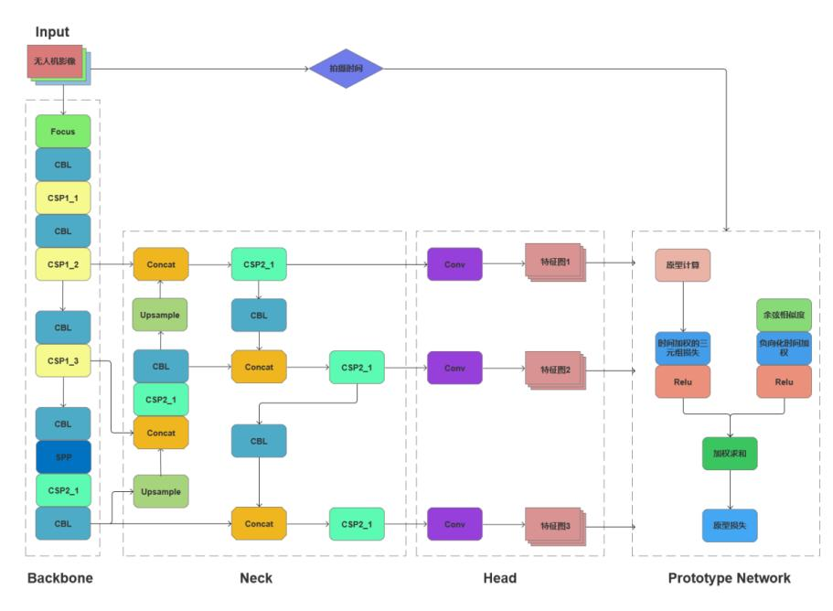

# 🌾 PN-YOLOv5: Prototypical Network Enhanced YOLOv5 for Automated Growth Monitoring

---

## 📝 Overview

PN-YOLOv5 is an innovative framework that integrates prototypical networks with YOLOv5 to enable automated monitoring of growth dynamics using UAV imagery. This project addresses the critical challenge of limited labeled data by introducing a novel two-stage training approach:

1. **Unsupervised Pre-training**: Leverages temporal information from unlabeled drone images to learn robust feature representations without requiring manual annotations.  
2. **Few-shot Supervised Fine-tuning**: Adapts the full YOLOv5 model integrated with the prototypical network for specific object detection tasks using minimal labeled data.

The framework supports end-to-end monitoring across key indicators such as phenological stages, object detection, and density estimation.

---

## 🏗 Architecture

The framework consists of two complementary components:

1. **Next-ViT Backbone**  
   Specialized for phenological stage recognition, extracting rich spatial-temporal features from UAV imagery.

2. **Modified YOLOv5 with Prototypical Network Integration**  
   Tailored for object detection tasks including pest/disease identification and density estimation.

### Core Innovations

- Prototype Computation Module: Dynamically calculates class prototypes guided by temporal metadata.  
- Adaptive Triplet Loss: Adjusts the margin based on time intervals between images to improve feature discrimination.  
- Cosine Similarity Constraint: Ensures temporal coherence in the learned feature space.

### Model Framework Illustration

*Figure: The overall framework of PN-YOLOv5, illustrating the integration of Next-ViT backbone for phenology recognition and prototypical network enhanced YOLOv5 for object detection, leveraging temporal metadata for improved feature learning.*

---

## ✨ Key Features

- **Reduced annotation dependency**: Requires up to 80% less labeled data compared to conventional methods.  
- **Multi-task capability**: Single unified framework for phenology recognition, object detection, and density estimation.  
- **Temporal-aware learning**: Utilizes shooting date metadata during the unsupervised phase to enhance feature learning.  
- **Field-ready performance**: Validated on real-world UAV imagery datasets.  
- **Actionable insights**: Converts detection results into meaningful application outputs.

---

## ▶️ Usage Instructions

To fully leverage PN-YOLOv5’s capabilities, please follow this two-stage training procedure:

1. **Unsupervised Pre-training**  
   Train the model on large amounts of unlabeled UAV imagery, exploiting temporal metadata (shooting dates) to learn robust, temporally-aware features without annotations.

2. **Few-shot Supervised Fine-tuning**  
   After unsupervised pre-training, fine-tune the full YOLOv5 model integrated with the prototypical network on a small labeled dataset to specialize for phenology classification, object detection, and density estimation.

---

## 📊 Datasets

We provide three curated datasets tailored for object detection research:

1. **Phenology Dataset** — 400 UAV images annotated across 6 growth stages.  
2. **Pest/Disease Dataset** — 954 images annotated with 6 common categories.  
3. **Density Dataset** — 53 high-resolution orthophotos capturing seedling density.

---

## 📜 License

[Your License Here]

---

## 📞 Contact

For questions or contributions, please contact [Your Name or Email].

